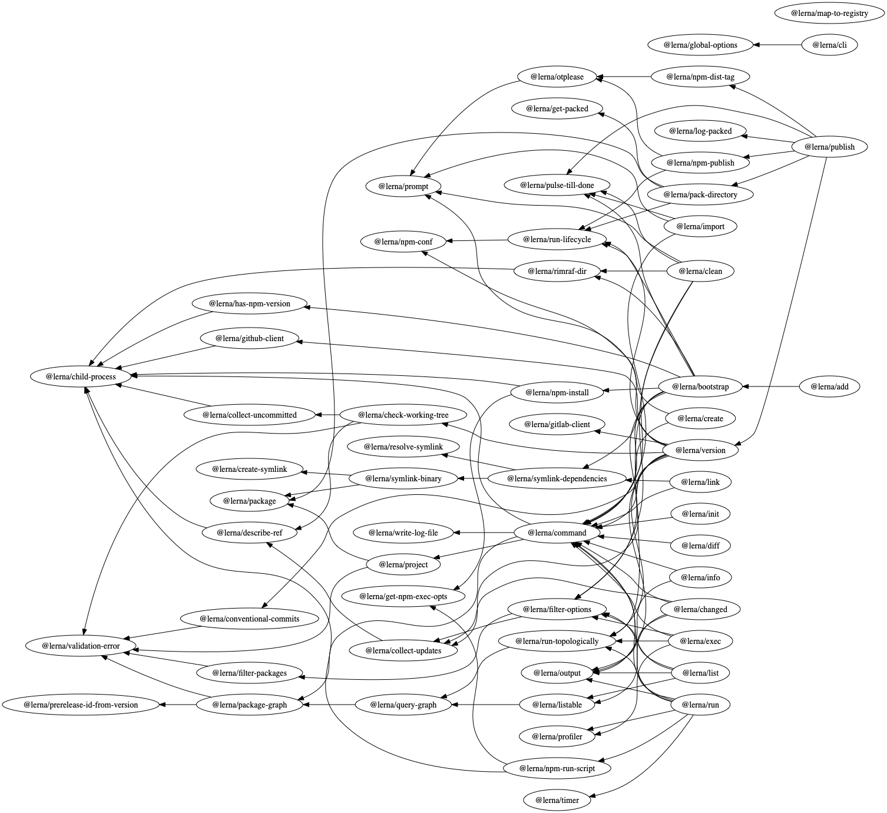

# Depsight

Dependency Insight (short Depsight) generates graphical representations of your
dependency trees.

- [Getting started](#getting-started)
- [Simple examples](#simple-examples)
- [from_npm](#from_npm)
- [Advanced usage](#advanced-usage)
  - [Whitelisting](#whitelisting)

## Getting started

Depsight contains a bunch of Python 3 scripts and uses
[the graphviz binary](https://www.graphviz.org/download/) and the graphviz
Python module to draw graphs. Setup should look something like this:

```sh
git clone https://github.com/webmaster128/depsight.git
cd depsight
export PATH="$PWD/bin:$PATH"

# Get your first graph
depsight examples/classes_and_resources.yml

# As PNG (e.g. for Github)
depsight --format png examples/classes_and_resources.yml

# Using a different graph engine
depsight --engine fdp examples/classes_and_resources.yml

# Show all the options
depsight --help
```

## Simple examples

- Simple example `depsight examples/classes_and_resources.yml`<br>
  
- With FDP engine `depsight --engine fdp examples/classes_and_resources.yml`<br>
  
- Circular dependencies `depsight examples/circular.yml`<br>
  

## from_npm

The binary `from_npm` creates a dependencies file from a npm repository, which
is especially useful to inspect monorepos. The output of `from_npm` can be piped
directly into `depsight`

### A simple example

An example usage is

```sh
git clone https://github.com/iov-one/iov-core
from_npm iov-core | depsight
```

We exclude all types packages for now to get a little bit more overview:

```sh
from_npm iov-core | depsight --exclude "^@types/"
```

[](examples/images/iov-core.pdf)

### Big examples

Both lerna and babel are big monorepos with many packages and dependencies. We
inspect both of them.

#### Babel

Run

```sh
git clone https://github.com/babel/babel
from_npm --exclude "babel-core/test/fixtures" babel | depsight
```

which results in the following graph (click to open as PDF):

[](examples/images/babel_monorepo.pdf)

#### Lerna

Run

```sh
git clone https://github.com/lerna/lerna
from_npm lerna --exclude "__fixtures__" | depsight
```

which results in the following graph (click to open as PDF):

[](examples/images/lerna_monorepo.pdf)

## Advanced usage

### Whitelisting

For big dependency graphs it can be handy to only look at a subset of elements.
The lerna example from above is so big that it is hard to reason about. With the
`--include` argument, we can filter elements by those in the @lerna namespace,
which improve the overview a lot.

Run

```sh
git clone https://github.com/lerna/lerna
from_npm lerna --exclude "__fixtures__" | depsight --include "^@lerna/"
```

which results in the following graph (click to open as PDF):

[](examples/images/lerna_monorepo_filtered.pdf)
